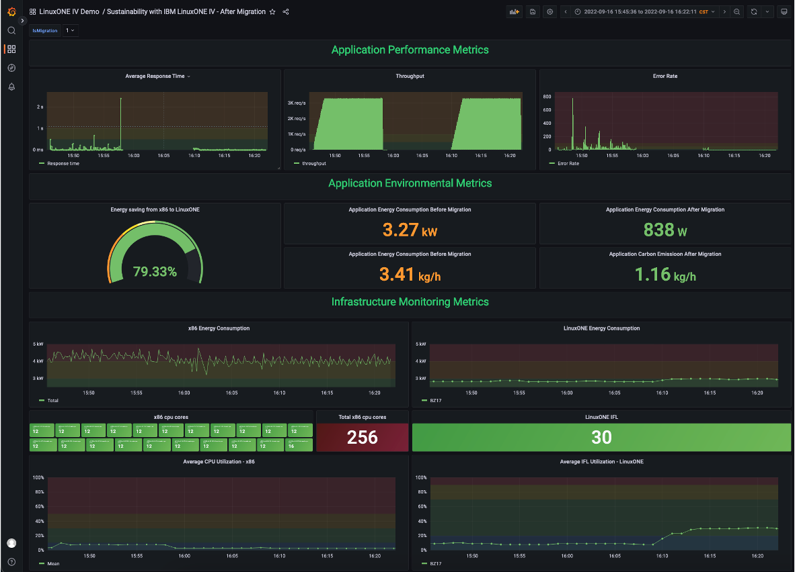

# sustainability-grafana-dashboard
Sustainability Grafana Dashboard visualizes major sustainability metrics of migrating workloads from x86 to LinuxONE

#Sustainability Metrics
Major sustainability metrics provided by the Sustainability Grafana Dashboard:
## Application Performance Metrics
| Category  | Metrics  | Unit  | Data Source Examples  |
|---|---|---|---|
| Application Performance Metric | Response Time  | millisecond | InfluxDB  |
|   | Throughput  | request per second  |  InfluxDB  |
|   |  Error Rate |   | InfluxDB  |
| Application Environmental Metric | Energy Consumption on x86  | Kilowatts | Zabbix  |
|   | Carbon Emission on x86  | co2e gram per hour  |  Zabbix  |
| | Energy Consumption on LinuxONE  | Kilowatts | Instana  |
|   | Carbon Emission on LinuxONE  | co2e gram per hour  |  Instana  |
|   | Energy Saving  | %  |  Zabbix & Instana  |
| Infrastructure Monitoring Metric | Energy Consumption of x86  | Kilowatts | Zabbix  |
|   | Energy Consumption of LinuxONE  | Kilowatts |  Instana  |
| | CPU cores of x86  | none | Zabbix  |
|   | IFL cores of LinuxONE  | none  |  Instana  |
|   | CPU Utilization of x86  | %  |  Instana  |
|   | IFL Utilization of LinuxONE  | %  |  Instana  |

## How to use
1. import the [sustainability-dashboard-templates](grafana-dashboards/sustainability-dashboard.json) into your grafana
2. replace _`data source`_ with your data source settings

## Sustainability Dashboard Sample
This is an example of the Sustainability Grafana Dashboard to visualize the sustainability metrics of migrating workloads from x86 to LinuxONE

